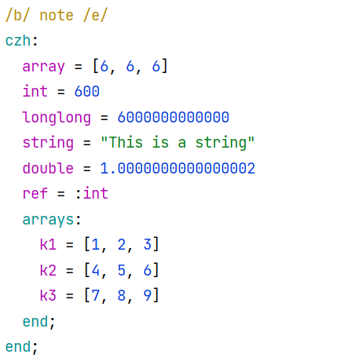

# libczh



- [README zh](README.md)
- [README en](README.en.md)
- [简体中文主页](https://libczh.vercel.app/)
- [English Page](https://libczh-en.vercel.app/)

## 介绍

- czh是caozhanhao设计的一个简单的数据序列化格式

## 使用方法

- czh和libczh的用法比较简单，你也可以直接看[example.cpp](examples/cpp/example.cpp)中的例子，它们涵盖了libczh的大部分内容。

### 语法

#### 数据类型

- `int`,`double`,`string`,`bool`,`array`,`ref`

#### 语句

- 可以没有缩进
- 语句后可以有`;`但不是必需的

#### 注释

- `<xxxx>`

#### Node

- 我们用Node表示一个节点，Value表示节点下的值
- Node和Value名不可重复
- 使用`id: end`作为一个Node
- 使用`id = xxx`作为一个Value

#### Array

- 使用`{}`

#### 引用

- 使用`id = key`表示引用
- 引用的作用域由`::`连接
- 只可以引用前面已定义的值

### libczh使用方法

#### 编译

- `#include "czh.hpp"`即可
- 需要C++17

#### Czh

##### Czh::Czh(str, mode)

###### mode

- `czh::InputMode::stream` -> 第一个参数为文件名
- `czh::InputMode::nonstream`->第一个参数为文件名
- `czh::InputMode::string`-> 第一个参数为存储czh的`std::string`

```c++
  Czh("example: a = 1; end;", czh::InputMode::string);
```

#### Node

###### Node::operator[str]

- 返回名为str的Node

###### Node::get<T>()

- 获取Value
- 仅Node可调用
- 当Value为Array时, STL中的大部分容器都可以直接使用
- 当T为自定义类型时，满足如下要求
- 有`insert()`、`end()`和默认构造函数的容器
- 有一个`value_type`的成员来表明类型
- 容器内部的类型为除Array和Reference的czh类型
- 当Array存储的类型不唯一时，T必须是czh::value::Array
```c++
auto arr = node["czh"]["any_array"].get<czh::value::Array>();
```

#### value_map

- 同一Node下的值的类型相同时时，可以使用value_map()获取所有key和value组成的map

###### Node::value_map<T>()

- 返回std::map<std::string, T>
- 仅Node可调用

```c++
auto vmap = example["example"]["valmap"].value_map<vector<int>>();
```

#### Value

###### Node::operator=(value)

- 仅Value可调用
- 与`Node::get<T>`类似， 当Value为Array时,T满足如下要求
- 有`begin()`、`end()`
- 有一个`value_type`的成员来表明类型
- 容器内部的类型为除Array和Reference的czh类型
- 可以直接使用`std::initializer_list`
- 当Array存储的类型不唯一时，使用`czh::value::Array`

```c++
node["czh"]["int_array"] = EgRange(1, 10);//begin() end() value_type
node["czh"]["int_array"] = {1, 2, 3};      
node["czh"]["any_array"] = {false, 1, "2", 3.0};//czh::value::Array
```

#### 修改

- 修改后可使用`operator<<`或`Node::to_string()`以更新文件

##### 添加

###### Node::add(key, value, before)

- 在名为`before`的Node前添加
- `before`默认为空，此时添加在末尾
- 返回添加的Node(存储Value)的引用

```c++
example["add"].add("add", "123", "edit");
```

```
add = 123
edit = xxx
```

###### Node::make_ref()

- 获取该Node的”引用“，用以在czh中添加引用
- 不可在被引用对象之前添加
```c++
 example["example"].add("ref",example["example"]["i"].make_ref());
```
```
i = 0
ref = i
```

###### Node::add_node(name, before)

- 在名为'before'的Node前添加
- 返回添加的Node的引用

```c++
example.add_node("newnode", "before");
```

```
newnode:
end
before:
xxx
end
```

##### 删除

###### Node::remove()

- 删除该Node

```c++
example["example"].remove();
```

##### 清除

###### Node::clear()

- 清除该Node下所有的Node

```c++
example["example"].clear();
```

##### 重命名

###### Node::rename(name, newname)

- 将该Node改为`newname`

```c++
example["a"].rename("b");
```

#### 输出

- 输出的czh不保留注释

###### Node::to_string(with_color)

- 返回格式化后的czh
- `czh::node::Color::with_color` 有高亮
- `czh::node::Color::no_color` 无高亮(默认)
- 不要将高亮的czh写入文件，否则无法解析

###### operator<<

- 输出`Node::to_string()`返回值
- 无高亮
